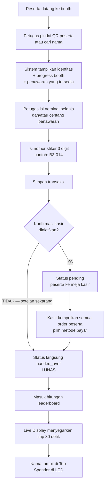

# Alur 1 — Dari Scan QR di Booth sampai Muncul di Top Spender

> Bahan presentasi. Semua angka di dokumen ini diverifikasi langsung dari database
> produksi pada 3 Agustus 2026, bukan dari nilai bawaan skema.
>
> Aplikasi: **Tally — Event Transaction Hub** · `eventhub.werkudara.group`
> Acara: **PRIMA Executive Gathering 2026**

---

## Ringkasan satu kalimat

Petugas booth memindai QR peserta, memasukkan nominal belanja, dan transaksi itu
langsung terhitung ke leaderboard Top Spender yang tampil di layar LED — tanpa ada
rekap manual di antaranya.

---

## Angka acara ini (per 3 Agustus 2026)

| Item | Nilai |
|---|---|
| Peserta aktif | **244 orang** |
| Booth | **9 booth**, semuanya aktif |
| Booth yang menerima transaksi | **8 booth** (Prima Hub / `PH` non-transaksi, hanya serah terima barang) |
| Penawaran spesial | 11 dibuat, **9 aktif**, 8 di antaranya dihitung ke leaderboard |
| Metode pembayaran aktif | **3** |
| Akun operator | **14 user** |
| Order tercatat | 5 order, total Rp 966.089 (data uji coba) |

---

## Alur utama (mode yang berjalan sekarang)

### Penting untuk disebut saat presentasi

Setelan produksi saat ini: **konfirmasi kasir DIMATIKAN** dan mode pengambilan
barang **`immediate`**. Artinya begitu petugas booth menekan simpan, order langsung
berstatus `handed_over` (lunas dan barang diserahkan) dan seketika masuk hitungan
leaderboard. Alur kasir tetap ada dan siap dipakai, tapi sekarang dilewati.

Bukti dari data: dari 5 order yang ada, **semuanya** berstatus `handed_over`, tidak
ada satu pun `pending`.

---

## Langkah demi langkah, versi teknis

### Langkah 1 — Menemukan peserta

Halaman `/booth` (`src/app/booth/page.tsx`). Dua cara:

- **Pindai QR** — memakai kamera perangkat lewat pustaka `@zxing/browser`. Kamera
  baru menyala setelah petugas membuka panel pemindai, bukan sepanjang waktu.
- **Cari nama atau instansi** — `GET /api/booth/participants?q=&boothId=`, mencocokkan
  nama dan perusahaan. Peserta yang sudah ditandai keluar oleh sistem sumber tidak
  ikut muncul.

Keduanya berujung ke `GET /api/participants/by-qr`, yang mengembalikan tiga hal
sekaligus dalam satu panggilan:

1. Identitas peserta
2. **Progress booth** — sudah mengunjungi berapa booth dari total booth aktif,
   dihitung dari order berstatus lunas
3. **Daftar penawaran** yang tersedia untuk peserta ini di booth ini, lengkap dengan
   alasan bila terkunci: kuota habis, stok habis, atau syarat belum terpenuhi

Nilai gunanya: petugas tidak perlu membuka layar lain untuk tahu peserta ini sudah
ke mana saja dan berhak dapat penawaran apa.

### Langkah 2 — Mengisi transaksi

Yang diinput petugas:

| Input | Catatan |
|---|---|
| Nominal belanja reguler | Sengaja kosong di awal, bukan diisi 0, supaya tidak ada order Rp 0 karena petugas lupa mengisi. Kolomnya disembunyikan otomatis untuk booth non-transaksi seperti Prima Hub. |
| Penawaran spesial | Dicentang dari daftar yang sudah disaring sistem |
| Nomor stiker 3 digit | Sistem menyarankan nomor berikutnya otomatis, petugas tinggal mengonfirmasi |

Metode pembayaran **tidak** diinput di booth — itu wewenang kasir. Booth yang dipakai
diambil dari akun petugas, bukan dipilih manual, supaya transaksi tidak bisa salah
booth.

Tombol simpan terkunci bila nominal masih kosong, atau bila nominal 0 tanpa satu pun
penawaran dipilih.

### Langkah 3 — Sistem membuat order

`POST /api/orders`, dijalankan sebagai satu transaksi database. Yang divalidasi:

- **Format kode order** harus `KODEBOOTH-NNN` dan awalannya wajib kode booth itu
  sendiri. Booth B3 tidak bisa membuat order bernomor B5.
- **Order kosong ditolak** — nominal 0 tanpa penawaran.
- **Booth non-transaksi ditolak** bila dikirimi nominal.
- **Per penawaran**: masih aktif, berlaku di booth ini, kuota per peserta belum
  terlampaui, syaratnya terpenuhi, dan stok masih ada. Stok langsung dikurangi.
- Harga penawaran **disnapshot** saat klaim, jadi perubahan harga setelahnya tidak
  mengubah nilai transaksi yang sudah terjadi.

Empat status order yang ada: `pending`, `paid`, `void`, `handed_over`.

### Langkah 4 — Kasir (sedang dilewati)

Bila konfirmasi kasir diaktifkan, halaman `/cashier` menampilkan antrean order
`pending` yang sudah dikelompokkan per peserta, disegarkan tiap 15 detik. Kasir
memindai QR peserta, melihat seluruh belanjaannya dari semua booth dalam satu daftar,
memilih metode bayar, lalu melunasi sekaligus.

Metode pembayaran dikelola admin, bukan dikunci di kode. Metode tertentu bisa
diwajibkan mengisi nomor referensi dengan jumlah digit tertentu — misalnya kode
approval EDC.

Pelunasan **hanya bisa dilakukan akun kasir**, bahkan admin tidak bisa. Ini pemisahan
wewenang yang disengaja.

### Langkah 5 — Jaring pengaman: pembatalan otomatis

Order `pending` yang tidak dibayar akan dibatalkan sendiri setelah **45 menit**.
Pemeriksaannya berjalan di database tiap 5 menit, dan sudah terverifikasi **aktif**
di produksi.

Saat order dibatalkan, stok penawaran yang sudah diklaim **dikembalikan** — jadi
peserta lain masih bisa mendapatkannya. Setiap pembatalan otomatis tercatat di audit
log dan ditandai sebagai tindakan sistem, bukan tindakan orang.

Kegunaannya: peserta yang mengambil barang lalu pergi tanpa membayar tidak
menyandera stok sampai acara selesai.

### Langkah 6 — Perhitungan leaderboard

Dihitung langsung di database, bukan di aplikasi:

- **Order yang dihitung**: hanya berstatus `paid` dan `handed_over`. Order `pending`
  dan `void` tidak dihitung sama sekali.
- **Total belanja** = nominal reguler **+** harga penawaran yang ditandai ikut
  dihitung. Saat ini 8 dari 9 penawaran aktif ikut dihitung.
- **Jumlah booth** = banyaknya booth berbeda yang sudah ditransaksikan.
- **Urutan**: total belanja tertinggi, bila seri jumlah booth terbanyak, bila masih
  seri urut nama.

Privasi ditegakkan di lapisan database, bukan di tampilan. Ada empat mode: nama utuh,
inisial, hanya perusahaan, atau disembunyikan. Peserta yang menolak namanya
ditampilkan **selalu** disamarkan menjadi inisial, apa pun setelan acaranya. Penolakan
individu menang atas setelan global.

Setelan produksi sekarang: mode **nama utuh**.

### Langkah 7 — Tampil di Live Display

Halaman `/display`, dirancang untuk dibuka lalu ditinggal di proyektor atau LED.

| Setelan | Nilai produksi |
|---|---|
| Penyegaran data | **tiap 30 detik** |
| Jumlah baris leaderboard | **10 besar** |
| Tampilkan perusahaan | ya |
| Panel progress booth | tidak |
| Teks berjalan | tidak |
| Judul | PRIMA Executive Gathering 2026 |
| Headline | Top Spender in PRIMA Hub Nusantara |

Yang bisa admin ubah tanpa menyentuh kode: judul, headline, tagline, tiga warna,
gambar latar, jumlah baris, interval penyegaran, dan saklar tiap panel.

**Dua tingkat saklar sembunyikan leaderboard**, dan keduanya harus menyala agar
tampil:

- **Lokal** — tombol di layar itu sendiri, hanya berlaku di perangkat tersebut, hilang
  saat dimuat ulang. Untuk operator yang perlu menutup cepat.
- **Server** — setelan admin, berlaku ke semua layar sekaligus dan bertahan.

Karena keduanya harus menyala, panitia di lokasi tidak bisa menampilkan leaderboard
yang sudah dimatikan admin dari pusat. Berguna saat sesi sambutan atau pengumuman
pemenang, ketika angka belanja sebaiknya tidak terpampang.

Ada juga mode layar penuh yang menyembunyikan seluruh tombol operator, supaya tidak
ada yang bisa mengubah tampilan LED secara tidak sengaja.

---

## Peran dan pembatasan akses

Empat peran: **booth**, **cashier**, **admin**, **super admin**.

| Kewenangan | Siapa |
|---|---|
| Membuat transaksi | Booth (hanya booth miliknya sendiri), admin |
| Melunasi pembayaran | **Kasir saja** |
| Membatalkan order yang sudah diserahkan | Admin ke atas saja |
| Mengelola user dan reset PIN | **Super admin saja** |
| Reset data acara | **Super admin saja** |
| Membuka Live Display | **Tanpa login** — layar bisa jalan sendiri |

Operator booth hanya bisa mengakses booth yang ditugaskan padanya. Setiap pembatalan
wajib menyertakan alasan, dan seluruh tindakan sensitif tercatat di audit log.

Sesi login berlaku 12 jam, atau 30 hari bila memilih "ingat saya".

---

## Poin yang layak ditonjolkan saat presentasi

1. **Tidak ada rekap manual.** Angka di LED datang langsung dari transaksi, dihitung
   di database. Tidak ada langkah salin-tempel yang bisa salah atau tertinggal.

2. **Satu kali pindai, tiga informasi.** Petugas langsung melihat identitas, riwayat
   kunjungan booth, dan penawaran yang berhak — tanpa membuka layar lain.

3. **Kesalahan dicegah di hulu, bukan diperbaiki di hilir.** Order Rp 0 ditolak,
   nomor stiker milik booth lain ditolak, stok dan kuota diperiksa sebelum tersimpan.

4. **Stok tidak tersandera.** Order menggantung dibatalkan otomatis setelah 45 menit
   dan stoknya kembali ke peredaran.

5. **Pemisahan wewenang nyata.** Booth tidak bisa melunasi, kasir tidak bisa
   menghapus, hanya super admin yang bisa menyentuh data akun.

6. **Bisa dikonfigurasi saat acara berjalan.** Alur kasir bisa dimatikan bila antrean
   menumpuk, tanpa deploy ulang. Itulah yang sedang berlaku sekarang.

7. **Privasi diputuskan di database.** Bukan sekadar disembunyikan di tampilan, jadi
   tidak bisa bocor lewat jalur lain.

---

## Catatan kejujuran teknis

Hal-hal yang perlu Anda ketahui supaya tidak salah bicara di depan audiens:

- **Data yang ada sekarang adalah data uji coba** — 5 order senilai Rp 966.089. Bukan
  transaksi acara sebenarnya.

- **Panel progress booth mematok 6 booth di kode**, sementara acara ini punya 9 booth
  aktif. Saat ini panel itu dimatikan (`show_booth_progress = false`) sehingga tidak
  terlihat, tapi bila kelak dinyalakan, tampilannya akan salah. Ini perlu diperbaiki
  sebelum panel itu dipakai.

- **Alur kasir belum pernah teruji dengan data acara sebenarnya**, karena setelan
  produksi melewatinya. Bila hari-H konfirmasi kasir dinyalakan, sebaiknya diuji dulu.

- Angka leaderboard **sudah** memasukkan harga penawaran spesial. Versi awal fungsi
  ini hanya menghitung nominal reguler; yang berjalan di produksi sekarang sudah
  diperbaiki.
