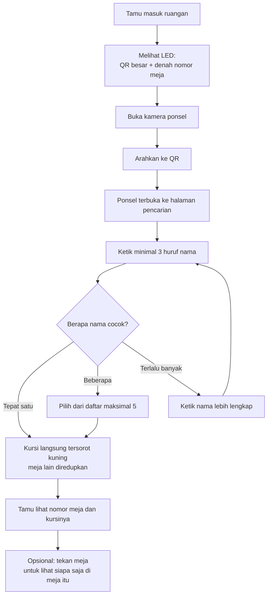

# Alur 2 — Cara Tamu Mengetahui Nomor Meja dan Kursinya

> Bahan presentasi. Semua angka diverifikasi langsung dari database produksi
> pada 3 Agustus 2026.
>
> Halaman: `eventhub.werkudara.group/denah` · terbuka tanpa login

---

## Ringkasan satu kalimat

LED di ruangan hanya menampilkan QR besar dan denah nomor meja; tamu memindai QR
dengan ponselnya sendiri, mengetik namanya, lalu kursinya langsung tersorot — daftar
tamu tidak pernah dipajang di ruang terbuka.

---

## Kenapa dirancang begitu

Acara ini dihadiri 244 peserta setingkat direksi. Memajang 199 nama lengkap beserta
jabatan dan perusahaan di layar ruang terbuka sama dengan menerbitkan daftar tamu:
siapa pun yang lewat bisa memfotonya.

Pemindaian QR memberi hasil yang sama — tamu tetap menemukan kursinya — tanpa biaya
privasi itu. Pencarian selalu terjadi di ponsel tamu masing-masing.

---

## Angka denah acara ini (terverifikasi produksi)

| Item | Nilai |
|---|---|
| Jumlah meja | **32 meja** |
| Jumlah kursi | **199 kursi** |
| Susunan baris | 8, 9, 8, 7 meja per baris dari depan |
| Kursi per meja | Meja 1–25 berisi 6 kursi, meja 26–32 berisi 7 kursi |
| Acuan arah | **LED SCREEN** di depan |
| Mode layar aktif | **QR untuk LED** |
| Agenda | 2, keduanya sudah publik |

Dua agenda yang sudah dikonfigurasi:

| Agenda | Judul di layar | Warna latar |
|---|---|---|
| Agenda Pagi — Meeting | PRIMA EXECUTIVE GATHERING 2026 | Hitam + gambar latar |
| Agenda Malam — Gala | PRIMA AWARDS 2026 | Merah marun |

Keduanya sudah tersambung ke sumber penempatan kursi masing-masing: Agenda Pagi ke
sub-event "Prima Executive Gathering", Agenda Malam ke "Prima Awards".

---

## Alur dari sudut pandang tamu

Tiga langkah yang tertulis di LED, sengaja sesingkat itu:

1. Buka kamera ponsel
2. Arahkan ke kode QR di atas
3. Ketik nama Anda

---

## Dua mode tampilan, satu halaman

| | Mode QR (LED) | Mode Pencarian (ponsel) |
|---|---|---|
| Untuk perangkat | LED / TV publik tanpa sentuh | Ponsel tamu, layar sentuh |
| Isi utama | QR besar, 3 langkah, denah | Kolom pencarian + denah interaktif |
| Nama peserta | **tidak ditampilkan sama sekali** | ditampilkan tersamar |
| Menyegarkan sendiri | ya, tiap 60 detik | tidak |

QR yang tampil di LED berisi alamat halaman denah itu sendiri dengan mode pencarian
dipaksa aktif. Jadi ponsel yang memindai langsung mendapat kolom pencarian, bukan
QR lagi.

Satu layar bisa dipaksa ke mode tertentu lewat alamatnya. Ini yang memungkinkan LED
dan layar sentuh berjalan berdampingan di acara yang sama tanpa berebut satu setelan.

### Detail yang menunjukkan ini dirancang untuk dipasang lalu ditinggal

- **Menyegarkan diri tiap 60 detik** tanpa perlu disentuh. Bila jaringan tersendat,
  data terakhir tetap tampil — layar tidak pernah mengosongkan diri. Yang berhenti
  bergerak hanya jam "Diperbarui" di bawah, jadi panitia tetap bisa menyadarinya
  tanpa pesan error yang menutupi layar.
- **Anti burn-in**: seluruh isi digeser beberapa piksel tiap 90 detik, supaya panel
  LED tidak meninggalkan bekas setelah menampilkan gambar sama berjam-jam.
- **Semua ukuran mengikuti ukuran layar**, bukan angka tetap. Satu halaman yang sama
  terbaca di monitor 24 inci maupun LED portrait beberapa meter.
- QR disimpan sementara di cache satu jam, jadi tetap tampil saat jaringan
  terganggu.

---

## Cara pencarian bekerja

- Minimal **3 huruf** sebelum sistem mulai mencari
- Menunggu **350 milidetik** setelah tamu berhenti mengetik, jadi tidak ada
  permintaan berlebihan setiap ketukan tombol
- Maksimal **5 hasil** ditampilkan. Bila lebih dari itu, sistem **tidak mengirim
  nama siapa pun** — hanya memberi tahu ada berapa yang cocok dan meminta tamu
  mengetik lebih lengkap. Ini mencegah halaman dipakai untuk mengumpulkan daftar
  tamu dengan mengetik satu huruf.
- Bila hasilnya tepat satu, kursinya langsung tersorot tanpa tamu perlu menekan
  apa pun

Pencocokan nama dilakukan di memori aplikasi, bukan dikirim sebagai kueri ke
database, sehingga apa yang diketik tamu tidak pernah menjadi bagian perintah SQL.

### Cara sorotan ditampilkan

- Kursi tamu diberi warna aksen dengan garis tebal
- Bulatan mejanya juga berubah warna
- **Semua meja lain diredupkan** menjadi 28% dengan transisi halus

Alasannya: tanpa peredupan, tamu harus membaca 32 nomor meja satu per satu untuk
menemukan mejanya. Dengan peredupan, matanya langsung tertuju.

Tamu juga bisa menekan meja mana pun untuk melihat daftar kursi di meja itu — berguna
untuk memastikan dia duduk bersama rekan yang tepat.

---

## Perlindungan privasi

Halaman ini terbuka tanpa login, jadi perlindungannya berlapis:

**Nama tidak pernah ditampilkan utuh di halaman denah.** Bahkan ketika setelan acara
memilih "nama utuh", halaman denah tetap menurunkannya menjadi inisial. Mode nama utuh
ditujukan untuk Live Display di ruangan tertutup, bukan halaman yang bisa dibuka siapa
saja dari internet.

Bentuk penyamarannya:

| Konteks | Yang tampil |
|---|---|
| Daftar penghuni meja | Inisial + perusahaan, contoh `B. S. — PT Contoh` |
| Hasil pencarian | Kata yang diketik tamu tampil utuh, kata lain jadi inisial |
| Mode LED | tidak ada nama sama sekali |

Kenapa hasil pencarian menampilkan sebagian utuh: tamu perlu yakin kursi yang
tersorot memang miliknya, bukan milik orang bernama mirip. Jadi bagian yang dia
ketik sendiri dikembalikan apa adanya, sisanya disamarkan.

Peserta juga bisa menolak namanya ditampilkan sama sekali, dan penolakan itu
dipertahankan setiap kali data disinkronkan dari sistem sumber — tidak terhapus
diam-diam.

---

## Pembagian tanggung jawab data

Ini poin arsitektur yang penting untuk disebut:

| Data | Pemilik |
|---|---|
| **Siapa duduk di kursi mana** | Scanner API (sistem sumber) — dibaca saja |
| **Meja nomor berapa ada di mana** | Aplikasi ini |

Aplikasi ini **tidak pernah menulis** penempatan peserta. Alasannya: kalau penempatan
bisa diedit di dua tempat, saat hari-H akan ada dua jawaban berbeda untuk pertanyaan
yang sama dan tidak ada yang tahu mana yang benar.

Sebaliknya, geometri ruangan tidak ada di sistem sumber, dan itulah yang disimpan di
sini.

Jembatan antara keduanya adalah **label kursi yang sama persis**. Perbedaan huruf
besar-kecil dan spasi ganda dianggap sama, karena itu beda penulisan bukan beda kursi.

---

## Yang bisa diatur admin tanpa menyentuh kode

Halaman `/admin/seat-map`. Pratinjaunya memakai penggambar yang sama dengan halaman
publik, jadi yang ditata admin persis yang dilihat tamu.

**Tata letak ruangan** (dipakai bersama semua agenda):

- Jumlah meja per baris
- Jumlah kursi per rentang nomor meja, termasuk pengecualian satu meja tertentu
- Pergeseran meja tertentu, misalnya karena terhalang pilar
- Nama acuan arah, sekarang "LED SCREEN"
- Pola penulisan label kursi, harus sama dengan sistem sumber
- Mode bawaan semua layar

**Per agenda** (yang berbeda antara sesi pagi dan malam):

- Judul dan sub judul di layar publik
- Sumber penempatan kursi, dipilih dari daftar bukan diketik manual
- Tiga warna: latar, teks, aksen
- Gambar latar, opsional
- **Denah tembus pandang** — agar gambar latar terlihat penuh di belakang meja
- Publikasikan atau simpan sebagai draf

**Agenda aktif** — satu dropdown yang memindahkan seluruh LED dari sesi pagi ke sesi
malam tanpa menyentuh perangkatnya. Berguna karena layar yang sudah dipasang di
dinding sulit dijangkau saat acara berjalan.

Tata letak sengaja **tidak digandakan** per agenda. Kalau digandakan, koreksi tata
letak harus dikerjakan berulang, dan begitu satu terlewat denah antar agenda berbeda
tanpa ada yang sadar.

---

## Jaring pengaman untuk panitia

Masalah paling berbahaya di alur ini bersifat senyap: **denah tampil rapi dan seolah
benar, padahal semua kursi kosong.** Kalau pola label tidak cocok dengan sistem
sumber, tidak ada pesan error apa pun — gejalanya baru muncul saat tamu tidak
menemukan namanya.

Karena itu CMS menampilkan **laporan pencocokan** per agenda:

- Berapa kursi terisi, berapa kosong
- Berapa peserta aktif yang belum punya kursi di sesi ini
- **Berapa label yang tidak ada di denah**, lengkap dengan contohnya

Bila ada label tidak cocok, muncul peringatan merah: label tersebut berarti ada
peserta yang **tidak muncul di mana pun**. Bila semua cocok, muncul tanda centang
hijau.

Peringatan lain yang disiapkan:

| Situasi | Yang muncul |
|---|---|
| Agenda publik tapi sumber penempatan belum dipilih | Peringatan kuning + langkah perbaikannya |
| Sumber penempatan hilang dari sistem sumber | Peringatan kuning, membedakan bahwa ini perlu diisi panitia di sisi sumber |
| Sistem sumber belum mengirim data kursi | "Pilihan akan muncul setelah panitia mengisinya" |
| Belum ada agenda dipublikasikan | Pengingat untuk mempublikasikan salah satu |

Dua penyebab "semua kursi kosong" sengaja dibedakan pesannya, karena **tindakan
pemulihannya berbeda**: yang satu perlu dipilih di CMS, yang satu perlu diisi panitia
di sistem sumber.

---

## Bila terjadi masalah saat acara

| Situasi | Yang dilihat tamu |
|---|---|
| Denah belum dipublikasikan | "Denah tempat duduk belum dipublikasikan. Silakan cek kembali nanti." |
| Penempatan belum tersedia | Denah tata letak ruangan tetap tampil, dengan keterangan bahwa penempatan belum ada |
| Jaringan gagal saat memuat | "Denah gagal dimuat." + tombol Coba lagi |
| Jaringan gagal di LED | **Data terakhir tetap tampil**, layar tidak dikosongkan |
| Nama tidak ditemukan | "Nama tidak ditemukan pada sesi ini." |
| Kata kunci terlalu umum | "Ada N nama yang cocok. Ketik nama lebih lengkap." |

LED menahan tampilan sampai data pertama berhasil dimuat, supaya tidak menampilkan
denah kosong sesaat lalu berubah — yang akan terlihat seperti alat rusak.

---

## Poin yang layak ditonjolkan saat presentasi

1. **Privasi tanpa mengorbankan kegunaan.** Daftar tamu tidak dipajang, tapi setiap
   tamu tetap menemukan kursinya dalam tiga langkah.

2. **LED dipasang lalu ditinggal.** Menyegarkan diri sendiri, tahan gangguan jaringan,
   dan tidak meninggalkan bekas di panel.

3. **Satu sumber kebenaran.** Penempatan peserta hanya ada di satu sistem, tidak bisa
   berbeda antara dua tempat.

4. **Dua agenda, satu tata letak.** Sesi pagi dan gala malam punya tampilan dan
   penempatan sendiri, tapi tata letak ruangannya sama dan hanya perlu ditata sekali.

5. **Pindah sesi tanpa menyentuh perangkat.** Satu dropdown memindahkan semua layar.

6. **Kesalahan senyap dibuat berbunyi.** Laporan pencocokan menangkap masalah yang
   tanpa itu baru ketahuan saat tamu mengeluh.

7. **Tidak bisa dipanen.** Pencarian menolak mengirim nama bila kata kuncinya terlalu
   umum, dan nama selalu tersamar.

---

## Catatan kejujuran teknis

- **Data kursi di sistem sumber baru berisi 1 peserta per sub-event**, jadi denah saat
  ini akan tampil hampir seluruhnya kosong. Kursi akan terisi setelah panitia
  melengkapi data penempatan di sisi scanner API. Ini bukan masalah di aplikasi ini.

- Angka 32 meja dan 199 kursi sudah terverifikasi dari database produksi, bukan
  perkiraan.

- Halaman denah **tidak menampilkan** jumlah label yang tidak cocok kepada tamu.
  Angka itu hanya terlihat panitia di CMS. Dari sisi tamu, gejalanya hanya "nama saya
  tidak ditemukan".

- Hasil pencarian **tidak** memeriksa penolakan tampil nama per peserta, sementara
  daftar penghuni meja memeriksanya. Nama tetap tersamar sebagian di kedua tempat.
  Perilaku ini terlihat jelas di kode, tapi tidak terdokumentasi apakah disengaja
  agar peserta tersebut masih bisa menemukan kursinya sendiri.
